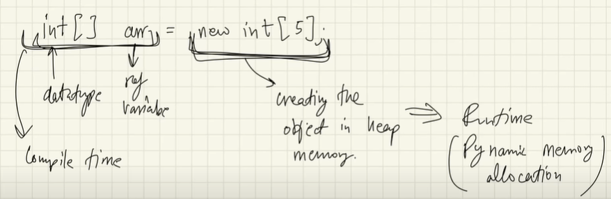

# Arrays

You can view the detailed notes here: [📄 Notes PDF](notes.pdf)

- If we have to store the roll number of five students then we can do it like: <br>
````  
Q: store 5 roll numbers
  int rno1 = 23; 
  int rno2 = 33;
  int rno3 = 43;
  int rno4 = 53;
  int rno5 = 63;
````
but what if, we have to store the roll nos. of 500 students, then we cannot store it like declare and reassign again and again. <br>
So, what we can do ? <br>
we have to use Arrays to store these collections of data. <br>

Q). What is an Array ? <br>
Ans- An array is basically a collections of datatypes, it can either be primitives or objects,
even complex datatypes. <br>
whatever we want to store, we can store  it in an array.

````
- Syntax
datatype[] variable_name = new datatype[size];

Q) store 5 roll numbers:

int[] rnos = new int[5];

// or directly
int[] rnos2 = {23, 12, 45, 32, 15};
````
- All the types of data in the array should be same. we cannot mix the datatypes in the array.
like: we cannot write , 1st is int, 2nd one is string , 3rd is float in the same array. <br>
e.g: int[ ] rnos3 = {23, "ramit", 45, 32};  ❌


- If we make a integer array, then it  should be array only. If we make a boolean array, then it should be boolean only. If It contains string, then it should be strings only.

````
int[] ros; //declaration of array. ros is getting defined in the stack.

ros = new int[5]; //initialisation: here actual object is being created in the memory(heap)
````

## Internal working of an Arrays:



- so in the above image, left sides of thing happens at compile time and right sides of thing happens at run time(also known as Dynamic memory allocation(DMA)). <br>

Q) What is dynamic memory allocation ? <br>
Ans:  At the runtime memory is allocated, that is called DMA.


