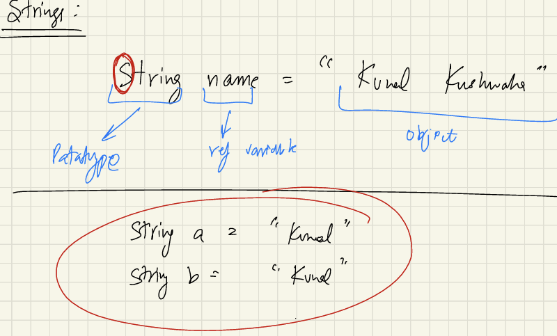
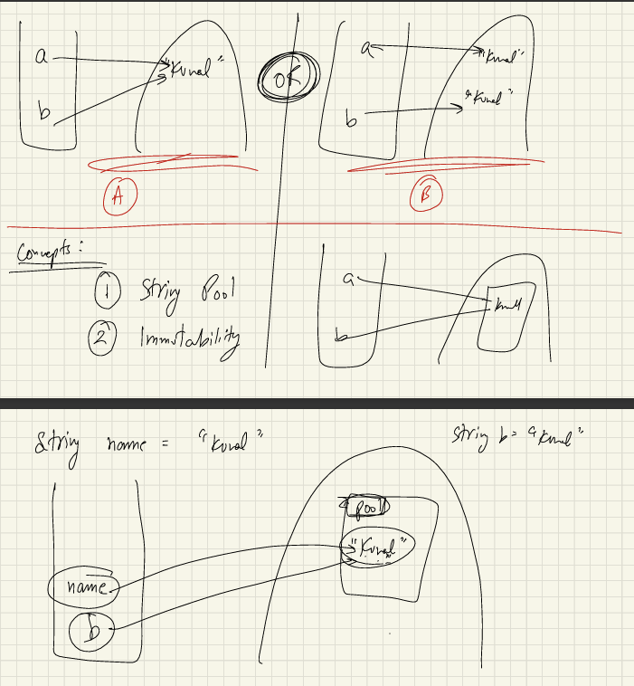
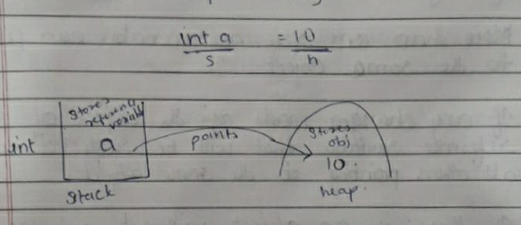
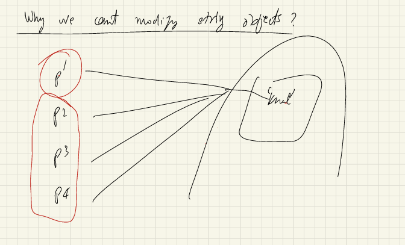
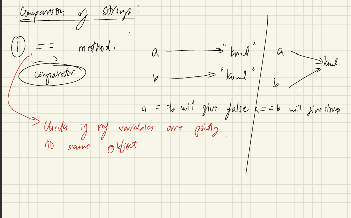
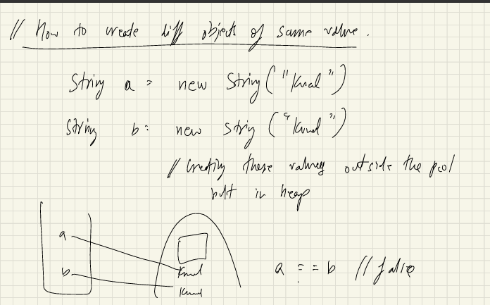

# Strings

You can view the detailed notes here: [📄Notes PDF](Notes_Strings.pdf)

- String is a collections of Characters.
- String is most commonly used class in the Java's Class library.
- Every thing which starts with a **Capital Letter** is a Class.
- String is a class, so instances of it, like "apple" , are objects.
- Every String that we create, it's actually an object of type String.
- Strings are immutable in java, once you create it(object), then neither you can change it
nor modify it.
- To change , we have to create new objects.
- String are immutable for security reasons.(for ex: If you are
storing someone's password or name)
 

## Let's see How String Works Internally, how memory management works : 




Q). What is String Pool? <br>
Ans-String Pool is a separate memory Structure inside the heap <br>

Q). What is the use case , why a separate pool?, Why can't you just put it 
out in the **Heap** normally, like we do for every other objects ? <br>
Ans-All the similar values of Strings are not like recreated in the pool. <br>

- a and b is in stack and "Kunal" is in Heap
- How it stores in the memory?, whether option a) is happening or option b) is happening. How do we check

Q). How do we compare values?, How do we check whether more than 
one reference variable are pointing to the same object or different object ? <br>
Let's see how we can do that..




````
String a = "Ramit Roshan
````
- Object (Ramit Roshan) point to the heap memory and Reference variable(a), points to the stack memory.

#### Q). Stack memory :- When we declare 'a' variable <br>
e.g: int a = 10; <br>
so, here the reference variable is stored in stack memory. <br>

#### Q). Heap memory :- Reference variable stored in stack memory is 
pointing to the object of that variable are Stored in Heap memory.




## Why String are Immutable ? 
- Here, all person 1 to person4 pointing to the same name and its 'kunal',
but when person 2 wants to change his name from "Kunal" to "Karan", then
all Person name from 1 to 4 will become change & it will become 'karan'. <br>
That's why, for Security reason. String is immutable.



```
public class Comparison {
    public static void main(String[] args) {

        //this is in String Pool,because the value (Kunal) is same in both.
        String a = "Kunal";
        String b = "Kunal";

        //But what is the proof of it, i.e ==
        System.out.println(a == b);

        //== it check both the values and reference variable
    }
}
```



- One side: a and b is pointing to two diff Object then it is False, Another side it is pointing to the same Object so it is **True**.
- we know, <br>
String a = "Kunal"; <br>
String b = "Kunal"; <br>
It will point to the same object, In what Scenario will this be **two Objects?**

### How to Create diff. Objects of Same Values
- here, a & b is in Stack memory and 'Kunal' is out of Pool, but in the Heap memory.
- We also use new String to create two diff. Objects.




## When you only need to check Value, then use .equals() methods.

```
public class Comparison {
    public static void main(String[] args) {
 
        //Even though the Value is same, but it may be pointing to the diff. Objects
        //Because we explicitly mentioned(ourself mentioned)
        String name1 = new String("Kunal");
        String name2 = new String("Kunal");
        System.out.println(name1 == name2); //false
        
        //It only care about the values
        System.out.println(name1.equals(name2));  //true
    }
}

```

## 📝 Pretty Printing in Java (printf)

Java provides formatted printing using System.out.printf(). <br>

Placeholders (also called format specifiers) define how values should be displayed.

````
public class PrettyPrinting {
    public static void main(String[] args) {
        float a = 453.1274f;
        //placeholder in java: %.2f
        System.out.printf("Formatted number is %.2f", a);
    }
}
````

Examples: 
```
float a = 453.1274f;
System.out.printf("Formatted number is %.2f", a);

//output: Formatted number is 453.13(13 is round off)

```
##### Explanation of %.2f:

% → introduces the format specifier.

.2 → precision, means show 2 digits after the decimal point.

f → type specifier for floating-point numbers.


##### Other Common Placeholders:

%d → integer

%f → float/double

%s → string

%c → character


#### More Examples: 
```
package String;

public class PrettyPrinting {
    public static void main(String[] args) {
 

        System.out.printf("Pie: %.3f", Math.PI);

        System.out.println(); //for new line
        
        //order should be same..
        System.out.printf("Hello my name is %s and I am %s", "Ramit", "Cool");
    }
}

O/P: Pie: 3.142
Hello my name is Ramit and I am Cool
```

## 🔄 Converting to String in Java

In Java, you can convert values like integers, arrays, or objects into strings using toString().

1. Integer to String
````
   int num = 100;
   String str = Integer.toString(num);   // Using wrapper class
   // or
   String str2 = String.valueOf(num);

   System.out.println(str);   // "100"
````

2. Array to String

- Directly calling toString() on an array will print something like [I@1b6d3586 (memory reference), not the contents.

- Use Arrays.toString() to get a readable format.
```
   import java.util.Arrays;

   int[] arr = {1, 2, 3, 4};
   System.out.println(arr.toString());          // [I@1b6d3586
   System.out.println(Arrays.toString(arr));    // [1, 2, 3, 4]

```