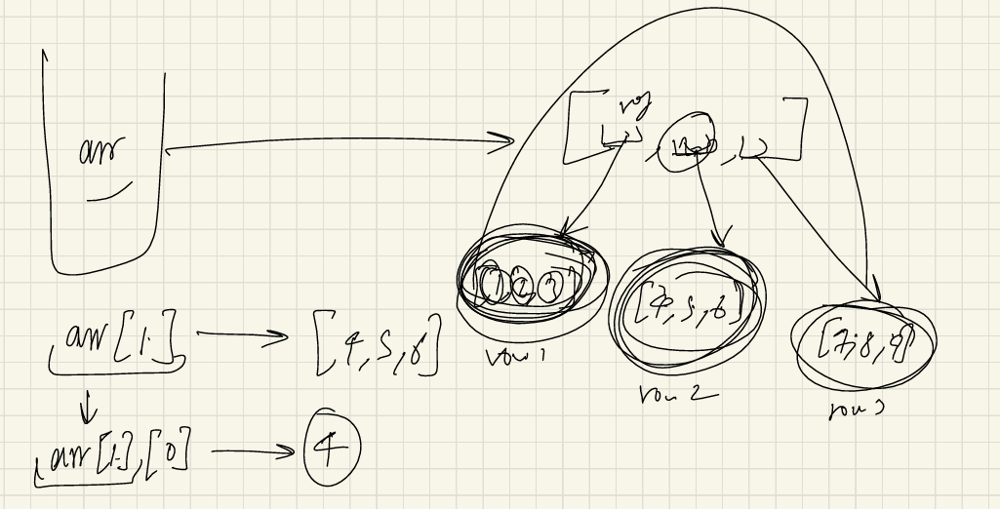
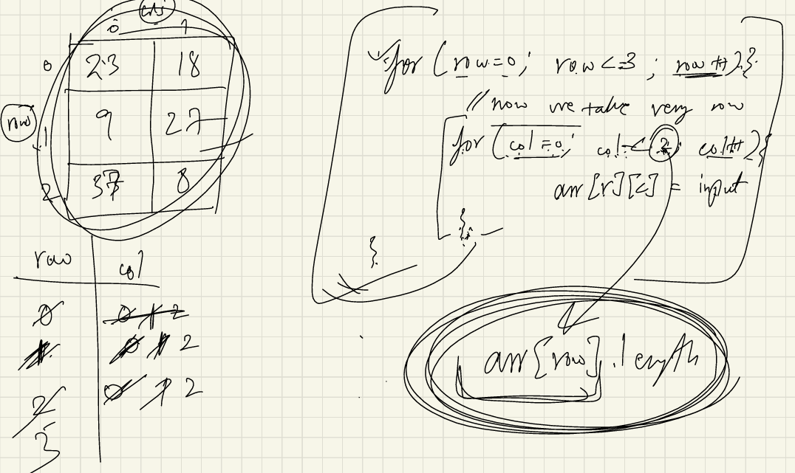

# Arrays

You can view the detailed notes here: [📄 Notes PDF](notes.pdf)

- If we have to store the roll number of five students then we can do it like: <br>

````  
Q: store 5 roll numbers
  int rno1 = 23; 
  int rno2 = 33;
  int rno3 = 43;
  int rno4 = 53;
  int rno5 = 63;
````

but what if, we have to store the roll nos. of 500 students, then we cannot store it like declare and reassign again and again. <br>
So, what we can do ? <br>
we have to use Arrays to store these collections of data. <br>


Q). What is an Array ? <br>
Ans- An array is basically a collections of datatypes, it can either be primitives or objects,
even complex datatypes. <br>
whatever we want to store, we can store  it in an array.


````
- Syntax
datatype[] variable_name = new datatype[size];

Q) store 5 roll numbers:

int[] rnos = new int[5];

// or directly
int[] rnos2 = {23, 12, 45, 32, 15};
````

- All the types of data in the array should be same. we cannot mix the datatypes in the array.
like: we cannot write , 1st is int, 2nd one is string , 3rd is float in the same array. <br>
e.g: int[ ] rnos3 = {23, "ramit", 45, 32};  ❌


- If we make a integer array, then it  should be array only. If we make a boolean array, then it should be boolean only. If It contains string, then it should be strings only.


````
int[] ros; //declaration of array. ros is getting defined in the stack.

ros = new int[5]; //initialisation: here actual object is being created in the memory(heap)
````

Q) What is the new keyword in Java? <br>
Ans: The new keyword is used to create objects and arrays in Java. <br>
It allocates memory in the heap and returns a reference to the created object/array.
(The new keyword is used to create an objects in heap memory)


Examples:  <br>
int[] arr = new int[5];      // creates an integer array of size 5 <br>
MyClass obj = new MyClass(); // creates an object of MyClass


## Internal working of an Arrays:


- so in the above image, left sides of thing happens at compile time and right sides of thing happens at run time(also known as Dynamic memory allocation(DMA)). <br>

Q) What is dynamic memory allocation ? <br>
Ans:  At the runtime memory is allocated, that is called DMA.

- In Arrays, Elements store in contiguous memory allocation. i.e it stores the elements one after one, there should be no gap between any of elements.

- continuous: here cells or memory are like one-by-one allocated.

- In Java, there is no concept of pointers like : c++. so here it totally depends on JVM, whether it will 
going to be continuous or not . <br> why ? 


- JLS(Java language specification): here it is clearly mentioned, Head objects are not continuous.

- Array objects are also in the Heap area, hence array objects in java may not be continuous.
  (even the defination of arrays: say it's a continuous data, but in java internally it may not be continuous). -> depends on JVM.
- Heap memory and Stack memory depends on JVM.


## Index of an Array

- Indexes in array start from 0. 
- For an integer array, by default it's just going to have all the zero elements 
- null -> not a single datatype.(it's a literal, not keywords).
- null can only assign to non-primitive


````
String str = null; ✅
int num = null; ❌

//String array
String[] arr = new String[4];
System.out.println(arr[0]);  //null
````

- Primitive-datatype(int, char,boolean.....) are stored in the Stack Memory. 
- all the other objects like: string type, array type or hashmap
, all the objects or the classes that we are making . These are stored in the Heap memory.


### Internal Working: 


- each particular element stored in a heap memory is an objects. and this entire each object
will be stored in different parts of the memory. <br>
This is how it works internally.

- Arrays.toString(arr); => it converts the array into string then print it.

- In Java, there is only call by value and when we pass an object reference, then 
it's actually going to take a copy of that reference, which is going to point to the same object.

- Strings are immutable in java, but Arrays are mutable(we can change the object) in java.


# 2D-Arrays

Q) Define a 2D array in Java ? <br>
Ans: A 2D array in Java is an array of arrays, used to store data in rows and columns format.
<br>

It can be thought of as a table with rows and columns, 
where each element is accessed using two indices: one for the row and one for the column.
<br>


Syntax:
````
// Declaration
dataType[][] arrayName;

// Declaration + Memory allocation
dataType[][] arrayName = new dataType[rows][columns];

// Declaration + Initialization
dataType[][] arrayName = {
    {value1, value2, value3},
    {value4, value5, value6}
};
````

Example:
````
int[][] matrix = new int[3][4]; // 3 rows, 4 columns
````
Initialization with values:
````
int[][] arr = {
    {1, 2, 3},
    {4, 5, 6}
};
````
Accessing elements:
````
arr[rowIndex][columnIndex];
````

Key Points:
- Index starts from 0
- Number of columns is not necessary to specify
- Adding(writing values in row) a rows is mandatory(Number of rows is mandatory, columns is not mandatory).
- Elements are stored row by row in memory. 
- You can have different column sizes for each row (called jagged array).
<br>


### Q). Difference Between 1D Array and 2D Array in Java ? 

| **1D Array**                                   | **2D Array**                                                    |
| ---------------------------------------------- | --------------------------------------------------------------- |
| Stores data in a **single row** (linear form). | Stores data in **rows and columns** (table form).               |
| Requires **one index** to access an element.   | Requires **two indices** (row and column) to access an element. |
| Syntax: `dataType[] arr = new dataType[size];` | Syntax: `dataType[][] arr = new dataType[rows][cols];`          |
| Example: `int[] arr = {1, 2, 3};`              | Example: `int[][] arr = {{1, 2}, {3, 4}};`                      |
| Suitable for storing a **list** of values.     | Suitable for storing **matrix-like** data.                      |


examples: <br>
````
int[][] arr = {
                {1, 2, 3},
                {4, 5, 6},
                {7, 8, 9}
        };
arr[0]; //[1, 2, 3]
arr[0][2]; // 3

````



- we can write 2-D array like this: (even individual array can also work).
````
int[][] arr = new int[3][];

int[][] arr = {
                {1, 2, 3},
                {4, 5},
                {6,7, 8, 9}
        };
````


- If we want to find the length of 2D-array, then it will going to give me the length of nos. of rows.
````
        int[][] arr = new int[3][4];
        System.out.println(arr.length); //it will give length of rows(no of rows)
//output: 3
````

- Taking input in the 2D-arrays
````
import java.util.Scanner;

public class MultiDimension2DArray {
    public static void main(String[] args) {
     
        Scanner sc = new Scanner(System.in);

//        int[][] arr = {
//                {1, 2, 3}, //0th index
//                {4, 5},  //1st index
//                {6,7, 8, 9} //2nd index -> arr[2] = {6,7,8,9}
//        };

        int[][] arr = new int[3][2];
        System.out.println(arr.length); //it will give length of rows(no of rows)

        //input
        for(int row=0; row<arr.length; row++){
        
            //for each col in every row, i want to take input.
            for(int col=0; col<arr[row].length; col++){
                arr[row][col] = sc.nextInt();
            }
        }
        
                //output
//        for(int row=0; row<arr.length; row++){
//            //for each col in every row, I want to take input.
//            for(int col=0; col<arr[row].length; col++){
//                System.out.print(arr[row][col] + " ");
//            }
//            System.out.println();
//        }

        //output
//        for(int row=0; row<arr.length; row++){
//            System.out.println(Arrays.toString(arr[row]));
//        }

        //output: using for each loop 
        //why int[] a: => the datatypes of every element is integer here 
        for(int[] a: arr){
            System.out.println(Arrays.toString(a));
        }

    }
}
````





# 📌ArrayList

**Definition:**  
`ArrayList` is a resizable array implementation of the `List` interface in Java. Unlike arrays, it can grow or shrink in size dynamically. <br>

A dynamic array in Java that can grow or shrink in size and stores elements like a list.


**Package:**
```
import java.util.ArrayList;
```


**Syntax:**
```
ArrayList<Type> listName = new ArrayList<Type>();
                  or
ArrayList<Type> listName = new ArrayList<>();
```


**Example:**
```
import java.util.ArrayList;

public class Example {
    public static void main(String[] args) {
        ArrayList<String> names = new ArrayList<>();
        names.add("Alice");
        names.add("Bob");
        names.add("Charlie");

        System.out.println(names.get(1)); // Output: Bob
    }
}

```


#### Internal Working of ArrayList: 
- Size is fixed Internally.
- Say Arraylist fills by some amount
    - It will create a new empty arraylist of say, double the size of arraylist initially.
    - Old elements are copied in the new arraylist.
    - Old one is deleted
- when the size of arraylist is filled half by array element, then the size it becomes double, and it keeps on going with every double size.


### **Common Methods:**
| Method                | Description                             |
| --------------------- | --------------------------------------- |
| `add(E e)`            | Adds an element to the end of the list. |
| `add(int index, E e)` | Adds element at a specific index.       |
| `get(int index)`      | Returns the element at the index.       |
| `set(int index, E e)` | Replaces element at given index.        |
| `remove(int index)`   | Removes element at given index.         |
| `size()`              | Returns the number of elements.         |
| `clear()`             | Removes all elements from the list.     |
| `contains(Object o)`  | Checks if element exists in the list.   |


## Difference Between Array and ArrayList in Java

| **Array**                                           | **ArrayList**                                               |
| --------------------------------------------------- | ----------------------------------------------------------- |
| Fixed size — cannot grow or shrink after creation.  | Dynamic size — grows and shrinks automatically.             |
| Can store **primitive types** and objects.          | Can store **only objects** (primitives need wrapper classes).|
| Syntax: `dataType[] arr = new dataType[size];`      | Syntax: `ArrayList<Type> list = new ArrayList<>();`         |
| No built-in methods for resizing or element search. | Has many built-in methods (`add`, `remove`, `contains`, etc.).|
| Faster for fixed-size data operations.              | Slower for insert/delete in the middle compared to arrays.  |
| Length accessed via `arr.length`.                   | Size accessed via `list.size()`.                            |


 Example: Array
```
public class ArrayExample {
    public static void main(String[] args) {
        int[] numbers = new int[3];
        numbers[0] = 10;
        numbers[1] = 20;
        numbers[2] = 30;

        System.out.println("First element: " + numbers[0]); // Output: 10
        System.out.println("Length: " + numbers.length);    // Output: 3
        
        // 2. Declare and initialize using array literal
        int[] nums = { 5, 15, 25, 35 };
        System.out.println("Second element: " + nums[1]);   // Output: 15
        System.out.println("Length: " + nums.length);       // Output: 4
    }
}
```

Example: ArrayList
```
import java.util.ArrayList;

public class ArrayListExample {
    public static void main(String[] args) {
        ArrayList<Integer> numbers = new ArrayList<>();
        numbers.add(10);
        numbers.add(20);
        numbers.add(30);

        System.out.println("First element: " + numbers.get(0)); // Output: 10
        System.out.println("Size: " + numbers.size());          // Output: 3
    }
}

```


## 📌 Java Array & ArrayList Cheat Sheet

| Feature              | 1D Array                                 | 2D Array                                      | ArrayList                                   |
|----------------------|------------------------------------------|-----------------------------------------------|---------------------------------------------|
| **Definition**       | Stores elements in a single row (linear).| Array of arrays, stored in rows & columns.    | Resizable array that implements List.       |
| **Size**             | Fixed at creation.                       | Fixed at creation (per row; jagged allowed).  | Dynamic — grows/shrinks automatically.      |
| **Indexing**         | One index: `arr[i]`                       | Two indices: `arr[row][col]`                  | One index: `list.get(i)`                    |
| **Data Type**        | Primitives & objects.                    | Primitives & objects.                         | Objects only (use wrapper classes).         |
| **Syntax**           | `int[] arr = new int[5];`                 | `int[][] arr = new int[3][4];`                 | `ArrayList<Type> list = new ArrayList<>();` |
| **Access Length/Size**| `arr.length`                             | `arr.length` (rows), `arr[row].length` (cols) | `list.size()`                               |
| **Example**          | `{1, 2, 3}`                              | `{{1,2,3}, {4,5,6}}`                          | `[1, 2, 3]`                                 |
| **Key Points**       | Fast access, fixed size.                  | Row-by-row storage, jagged arrays allowed.    | Many built-in methods, maintains order.     |
