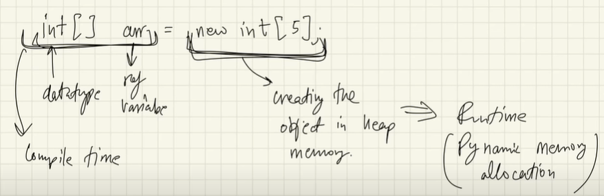
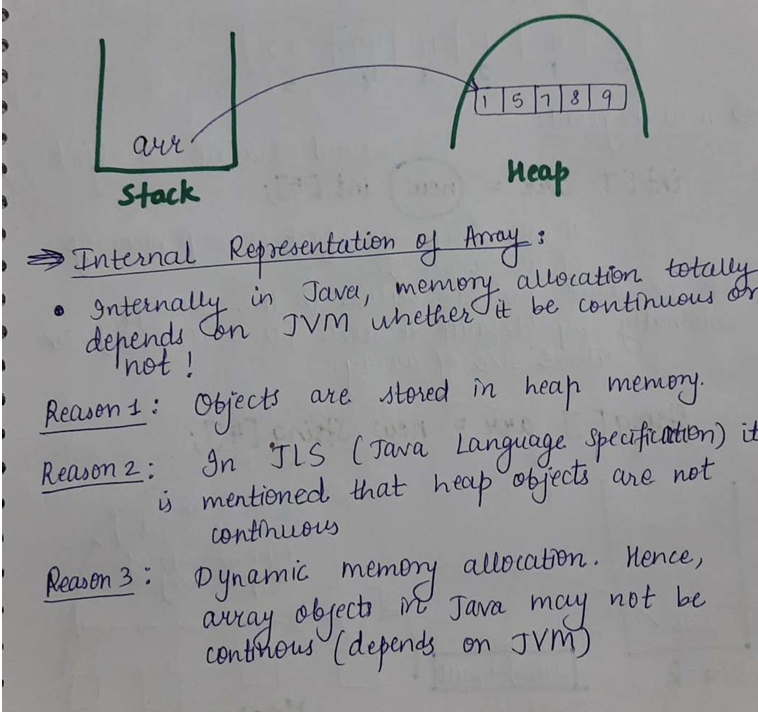
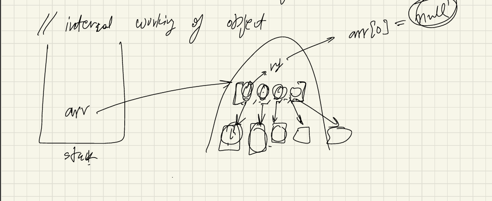

# Arrays

You can view the detailed notes here: [📄 Notes PDF](notes.pdf)

- If we have to store the roll number of five students then we can do it like: <br>
````  
Q: store 5 roll numbers
  int rno1 = 23; 
  int rno2 = 33;
  int rno3 = 43;
  int rno4 = 53;
  int rno5 = 63;
````
but what if, we have to store the roll nos. of 500 students, then we cannot store it like declare and reassign again and again. <br>
So, what we can do ? <br>
we have to use Arrays to store these collections of data. <br>

Q). What is an Array ? <br>
Ans- An array is basically a collections of datatypes, it can either be primitives or objects,
even complex datatypes. <br>
whatever we want to store, we can store  it in an array.

````
- Syntax
datatype[] variable_name = new datatype[size];

Q) store 5 roll numbers:

int[] rnos = new int[5];

// or directly
int[] rnos2 = {23, 12, 45, 32, 15};
````
- All the types of data in the array should be same. we cannot mix the datatypes in the array.
like: we cannot write , 1st is int, 2nd one is string , 3rd is float in the same array. <br>
e.g: int[ ] rnos3 = {23, "ramit", 45, 32};  ❌


- If we make a integer array, then it  should be array only. If we make a boolean array, then it should be boolean only. If It contains string, then it should be strings only.

````
int[] ros; //declaration of array. ros is getting defined in the stack.

ros = new int[5]; //initialisation: here actual object is being created in the memory(heap)
````

Q) What is the new keyword in Java? <br>
Ans: The new keyword is used to create objects and arrays in Java. <br>
It allocates memory in the heap and returns a reference to the created object/array.
(The new keyword is used to create an objects in heap memory)

Examples:  <br>
int[] arr = new int[5];      // creates an integer array of size 5 <br>
MyClass obj = new MyClass(); // creates an object of MyClass


## Internal working of an Arrays:



- so in the above image, left sides of thing happens at compile time and right sides of thing happens at run time(also known as Dynamic memory allocation(DMA)). <br>

Q) What is dynamic memory allocation ? <br>
Ans:  At the runtime memory is allocated, that is called DMA.

- In Arrays, Elements store in contiguous memory allocation. i.e it stores the elements one after one, there should be no gap between any of elements.

- continuous: here cells or memory are like one-by-one allocated.

- In Java, there is no concept of pointers like : c++. so here it totally depends on JVM, whether it will 
going to be continuous or not . <br> why ? 




- JLS(Java language specification): here it is clearly mentioned, Head objects are not continuous.

- Array objects are also in the Heap area, hence array objects in java may not be continuous.
  (even the defination of arrays: say it's a continuous data, but in java internally it may not be continuous). -> depends on JVM.
- Heap memory and Stack memory depends on JVM.


## Index of an Array

- Indexes in array start from 0. 
- For an integer array, by default it's just going to have all the zero elements 
- null -> not a single datatype.(it's a literal, not keywords).
- null can only assign to non-primitive

````
String str = null; ✅
int num = null; ❌

//String array
String[] arr = new String[4];
System.out.println(arr[0]);  //null
````

- Primitive-datatype(int, char,boolean.....) are stored in the Stack Memory. 
- all the other objects like: string type, array type or hashmap
, all the objects or the classes that we are making . These are stored in the Heap memory.

### Internal Working: 



- each particular element stored in a heap memory is an objects. and this entire each object
will be stored in different parts of the memory. <br>
This is how it works internally.

- Arrays.toString(arr); => it converts the array into string then print it.

- In Java, there is only call by value and when we pass an object reference, then 
it's actually going to take a copy of that reference, which is going to point to the same object.

- Strings are immutable in java, but Arrays are mutable(we can change the object) in java.


# 2D-Arrays

Q) Define a 2D array in Java ? <br>
Ans: A 2D array in Java is an array of arrays, used to store data in rows and columns format.
<br>

It can be thought of as a table with rows and columns, 
where each element is accessed using two indices: one for the row and one for the column.
<br>

Syntax:
````
// Declaration
dataType[][] arrayName;

// Declaration + Memory allocation
dataType[][] arrayName = new dataType[rows][columns];

// Declaration + Initialization
dataType[][] arrayName = {
    {value1, value2, value3},
    {value4, value5, value6}
};
````

Example:
````
int[][] matrix = new int[3][4]; // 3 rows, 4 columns
````
Initialization with values:
````
int[][] arr = {
    {1, 2, 3},
    {4, 5, 6}
};
````
Accessing elements:
````
arr[rowIndex][columnIndex];
````

Key Points:
- Index starts from 0
- Number of columns is not necessary to specify
- Adding a rows is mandatory(Number of rows is mandatory, columns is not mandatory).
- Elements are stored row by row in memory. 
- You can have different column sizes for each row (called jagged array).
<br>

### Q). Difference Between 1D Array and 2D Array in Java ? 

| **1D Array**                                   | **2D Array**                                                    |
| ---------------------------------------------- | --------------------------------------------------------------- |
| Stores data in a **single row** (linear form). | Stores data in **rows and columns** (table form).               |
| Requires **one index** to access an element.   | Requires **two indices** (row and column) to access an element. |
| Syntax: `dataType[] arr = new dataType[size];` | Syntax: `dataType[][] arr = new dataType[rows][cols];`          |
| Example: `int[] arr = {1, 2, 3};`              | Example: `int[][] arr = {{1, 2}, {3, 4}};`                      |
| Suitable for storing a **list** of values.     | Suitable for storing **matrix-like** data.                      |


