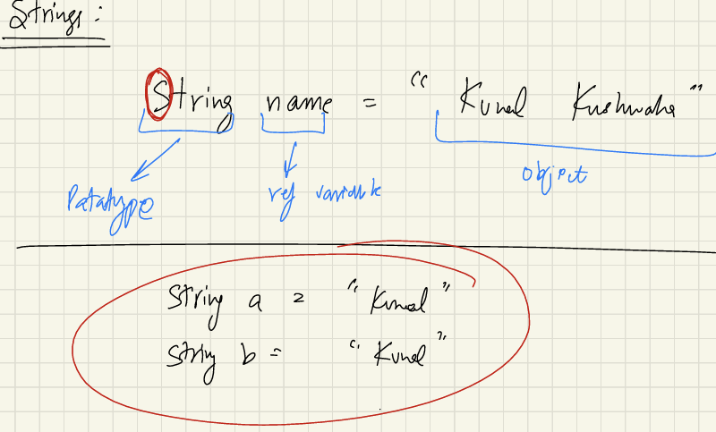

# Strings

You can view the detailed notes here: [📄Notes PDF](Notes_Strings.pdf)

- String is a collections of Characters.
- String is most commonly used class in the Java's Class library.
- Every thing which starts with a **Capital Letter** is a Class.
- String is a class, so instances of it, like "apple" , are objects.
- Every String that we create, it's actually an object of type String.
- Strings are immutable in java, once you create it(object), then neither you can change it
nor modify it.
- To change , we have to create new objects.
- String are immutable for security reasons.
 

## Let's see How String Works Internally, how memory management works : 

- a and b is in stack and "Kunal" is in Heap

Q). What is String Pool?  
Ans-String Pool is a separate memory Structure inside the heap  

Q). What is the use case , why a separate pool?, Why can't you just put it 
out in the **Heap** normally, like we do for every other objects ?  
Ans-All the similar values of Strings are not like recreated in the pool.  

- How it stores in the memory?